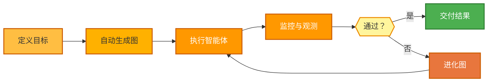

<p align="center">
  
</p>

<p align="center">
  <a href="../../README.md">English</a> |
  <a href="zh-CN.md">简体中文</a> |
  <a href="es.md">Español</a> |
  <a href="hi.md">हिन्दी</a> |
  <a href="pt.md">Português</a> |
  <a href="ja.md">日本語</a> |
  <a href="ru.md">Русский</a> |
  <a href="ko.md">한국어</a>
</p>

<p align="center">
  <a href="https://github.com/adenhq/hive/blob/main/LICENSE"></a>
  <a href="https://www.ycombinator.com/companies/aden"></a>
  <a href="https://discord.com/invite/MXE49hrKDk"></a>
  <a href="https://x.com/aden_hq"></a>
  <a href="https://www.linkedin.com/company/teamaden/"></a>
  
</p>

<p align="center">
  
  
  
  
  
</p>
<p align="center">
  
  
  
</p>

## 概述

构建可靠的、自主的、自我改进的 AI 智能体，无需硬编码工作流。通过与编码智能体对话来定义目标，框架会生成带有动态创建连接代码的节点图。当出现问题时，框架会捕获故障数据，通过编码智能体进化智能体，并重新部署。内置的人机协作节点、凭证管理和实时监控让您在保持适应性的同时拥有完全控制权。

访问 [adenhq.com](https://adenhq.com) 获取完整文档、示例和指南。

## Hive 适合谁？

Hive 专为想要**构建生产级 AI 智能体**而无需手动编写复杂工作流的开发者和团队设计。

以下情况 Hive 非常适合您：

- 希望 AI 智能体**执行真实业务流程**，而不仅仅是演示
- 偏好**目标驱动开发**，而非硬编码工作流
- 需要**自愈和自适应智能体**，随时间不断改进
- 要求**人机协作控制**、可观测性和成本限制
- 计划在**生产环境**中运行智能体

如果您只是在做简单的实验性智能体链或一次性脚本，Hive 可能并不是最佳选择。

## 何时使用 Hive？

在以下场景中使用 Hive：

- 长时间运行的自主智能体
- 强护栏、流程和控制要求
- 基于失败持续改进
- 多智能体协调
- 随目标演进的框架

## 快速链接

- **[文档](https://docs.adenhq.com/)** - 完整指南和 API 参考
- **[自托管指南](https://docs.adenhq.com/getting-started/quickstart)** - 在您的基础设施上部署 Hive
- **[更新日志](https://github.com/adenhq/hive/releases)** - 最新更新和版本
- **[路线图](../../docs/roadmap.md)** - 即将推出的功能和计划
- **[报告问题](https://github.com/adenhq/hive/issues)** - Bug 报告和功能请求
- **[贡献指南](../../CONTRIBUTING.md)** - 如何贡献和提交 PR

## 快速开始

### 前置要求

- Python 3.11+ - 用于智能体开发
- Claude Code、Codex CLI 或 Cursor - 用于使用智能体技能

> **Windows 用户注意：** 强烈建议使用 **WSL（Windows Subsystem for Linux）** 或 **Git Bash** 运行本框架。某些核心自动化脚本在标准命令提示符或 PowerShell 中可能无法正确执行。

### 安装

> **注意**
> Hive 使用 `uv` 工作区布局，不通过 `pip install` 安装。
> 从仓库根目录运行 `pip install -e .` 只会创建一个占位包，Hive 将无法正常运行。
> 请使用下方的 quickstart 脚本来设置环境。

```bash
# 克隆仓库
git clone https://github.com/adenhq/hive.git
cd hive

# 运行 quickstart 设置
./quickstart.sh
```

该脚本将安装：

- **framework** - 核心智能体运行时和图执行器（在 `core/.venv` 中）
- **aden_tools** - 智能体能力所需的 MCP 工具（在 `tools/.venv` 中）
- **凭证存储** - 加密 API 密钥存储（`~/.hive/credentials`）
- **LLM 提供商** - 交互式默认模型配置
- 使用 `uv` 安装所有必需的 Python 依赖

### 构建您的第一个智能体

```bash
# 使用 Claude Code 构建智能体
claude> /hive

# 测试您的智能体
claude> /hive-debugger

# （在单独终端）启动交互式仪表盘
hive tui

# 或直接运行
hive run exports/your_agent_name --input '{"key": "value"}'
```

## 编码智能体支持

### Codex CLI

Hive 原生支持 [OpenAI Codex CLI](https://github.com/openai/codex)（v0.101.0+）。

1. **配置：** `.codex/config.toml` 包含 `agent-builder` MCP 服务器（已纳入 git 追踪）
2. **技能：** `.agents/skills/` 指向 Hive 技能的符号链接（已纳入 git 追踪）
3. **启动：** 在仓库根目录运行 `codex`，然后输入 `use hive`

### Opencode

Hive 原生支持 [Opencode](https://github.com/opencode-ai/opencode)。

1. **设置：** 运行 quickstart 脚本
2. **启动：** 在项目根目录打开 Opencode
3. **激活：** 在聊天中输入 `/hive` 切换到 Hive Agent
4. **验证：** 询问智能体 *"List your tools"* 确认连接

**[📖 完整设置指南](../../docs/environment-setup.md)** - 智能体开发的详细说明

### Antigravity IDE 支持

技能和 MCP 服务器也适用于 [Antigravity IDE](https://antigravity.google/)（Google 的 AI 驱动 IDE）。**最简单的方式：** 在 hive 仓库文件夹中打开终端并运行（使用 `./` — 脚本在仓库内部）：

```bash
./scripts/setup-antigravity-mcp.sh
```

**重要：** 运行设置脚本后务必重启/刷新 Antigravity IDE — MCP 服务器仅在启动时加载。重启后，**agent-builder** 和 **tools** MCP 服务器应该可以连接。技能位于 `.agent/skills/` 下（指向 `.claude/skills/` 的符号链接）。

## 功能特性

- **[目标驱动开发](../../docs/key_concepts/goals_outcome.md)** - 用自然语言定义目标；编码智能体生成智能体图和连接代码来实现它们
- **[自适应](../../docs/key_concepts/evolution.md)** - 框架捕获故障，根据目标进行校准，并进化智能体图
- **[动态节点连接](../../docs/key_concepts/graph.md)** - 没有预定义边；连接代码由任何有能力的 LLM 根据您的目标生成
- **SDK 封装节点** - 每个节点开箱即用地获得共享内存、本地 RLM 内存、监控、工具和 LLM 访问
- **[人机协作](../../docs/key_concepts/graph.md#human-in-the-loop)** - 干预节点暂停执行以等待人工输入，支持可配置的超时和升级
- **实时可观测性** - WebSocket 流式传输用于实时监控智能体执行、决策和节点间通信
- **交互式 TUI 仪表盘** - 带有实时图形视图、事件日志和对话界面的终端仪表盘
- **成本与预算控制** - 设置支出限制、节流和自动模型降级策略
- **生产就绪** - 可自托管，为规模和可靠性而构建

## 集成

Hive 被构建为模型无关和系统无关的框架。

- **LLM 灵活性** - Hive 框架设计支持各种类型的 LLM，包括通过 LiteLLM 兼容提供商的托管和本地模型
- **业务系统连接** - Hive 框架设计通过 MCP 将各种业务系统作为工具连接，如 CRM、支持、消息、数据、文件和内部 API

## 为什么选择 Aden

Hive 专注于生成运行真实业务流程的智能体，而非通用智能体。Hive 颠覆了这一范式：**您描述结果，系统自动构建自己**——提供目标驱动的、自适应的体验，配备易用的工具集和集成。



### Aden 的优势

| 传统框架               | Hive                               |
| ---------------------- | ---------------------------------- |
| 硬编码智能体工作流     | 用自然语言描述目标                 |
| 手动图定义             | 自动生成智能体图                   |
| 被动错误处理           | 结果评估和自适应                   |
| 静态工具配置           | 动态 SDK 封装节点                  |
| 单独设置监控           | 内置实时可观测性                   |
| DIY 预算管理           | 集成成本控制与降级                 |

### 工作原理

1. **[定义目标](../../docs/key_concepts/goals_outcome.md)** → 用简单语言描述您想要实现的目标
2. **编码智能体生成** → 创建[智能体图](../../docs/key_concepts/graph.md)、连接代码和测试用例
3. **[工作节点执行](../../docs/key_concepts/worker_agent.md)** → SDK 封装节点以完全可观测性和工具访问运行
4. **控制平面监控** → 实时指标、预算执行、策略管理
5. **[自适应](../../docs/key_concepts/evolution.md)** → 失败时，系统进化图并自动重新部署

## 运行智能体

`hive` CLI 是运行智能体的主要界面。

```bash
# 交互式浏览和运行智能体（推荐）
hive tui

# 直接运行特定智能体
hive run exports/my_agent --input '{"task": "Your input here"}'

# 使用 TUI 仪表盘运行特定智能体
hive run exports/my_agent --tui

# 交互式 REPL
hive shell
```

TUI 会扫描 `exports/` 和 `examples/templates/` 中的可用智能体。

> **直接使用 Python（替代方式）：** 也可以使用 `PYTHONPATH=exports uv run python -m agent_name run --input '{...}'` 运行智能体

完整设置说明请参阅 [environment-setup.md](../../docs/environment-setup.md)。

## 文档

- **[开发者指南](../../docs/developer-guide.md)** - 开发者综合指南
- [入门指南](../../docs/getting-started.md) - 快速设置说明
- [TUI 指南](../../docs/tui-selection-guide.md) - 交互式仪表盘使用
- [配置指南](../../docs/configuration.md) - 所有配置选项
- [架构概述](../../docs/architecture/README.md) - 系统设计和结构

## 路线图

Aden 智能体框架旨在帮助开发者构建面向结果的、自适应的智能体。详情请参阅 [roadmap.md](../../docs/roadmap.md)。

## 贡献

我们欢迎社区贡献！我们特别希望获得构建工具、集成和框架示例智能体的帮助（[查看 #2805](https://github.com/adenhq/hive/issues/2805)）。如果您有兴趣扩展其功能，这是最好的起点。请参阅 [CONTRIBUTING.md](../../CONTRIBUTING.md) 了解指南。

**重要：** 请在提交 PR 之前先认领 Issue。在 Issue 下评论认领，维护者将在 24 小时内分配给您。这有助于避免重复工作。

1. 找到或创建 Issue 并获得分配
2. Fork 仓库
3. 创建功能分支（`git checkout -b feature/amazing-feature`）
4. 提交更改（`git commit -m 'Add amazing feature'`）
5. 推送到分支（`git push origin feature/amazing-feature`）
6. 创建 Pull Request

## 社区与支持

我们使用 [Discord](https://discord.com/invite/MXE49hrKDk) 进行支持、功能请求和社区讨论。

- Discord - [加入我们的社区](https://discord.com/invite/MXE49hrKDk)
- Twitter/X - [@adenhq](https://x.com/aden_hq)
- LinkedIn - [公司主页](https://www.linkedin.com/company/teamaden/)

## 加入我们的团队

**我们正在招聘！** 加入我们的工程、研究和市场推广团队。

[查看开放职位](https://jobs.adenhq.com/a8cec478-cdbc-473c-bbd4-f4b7027ec193/applicant)

## 安全

有关安全问题，请参阅 [SECURITY.md](../../SECURITY.md)。

## 许可证

本项目采用 Apache License 2.0 许可证 - 详情请参阅 [LICENSE](../../LICENSE) 文件。

## 常见问题（FAQ）

**问：Hive 支持哪些 LLM 提供商？**

Hive 通过 LiteLLM 集成支持 100 多个 LLM 提供商，包括 OpenAI（GPT-4、GPT-4o）、Anthropic（Claude 模型）、Google Gemini、DeepSeek、Mistral、Groq 等。只需设置适当的 API 密钥环境变量并指定模型名称即可。

**问：我可以在 Hive 中使用 Ollama 等本地 AI 模型吗？**

可以！Hive 通过 LiteLLM 支持本地模型。只需使用模型名称格式 `ollama/model-name`（例如 `ollama/llama3`、`ollama/mistral`），并确保 Ollama 在本地运行即可。

**问：Hive 与其他智能体框架有何不同？**

Hive 使用编码智能体从自然语言目标生成整个智能体系统——您无需硬编码工作流或手动定义图。当智能体失败时，框架会自动捕获故障数据、[进化智能体图](../../docs/key_concepts/evolution.md)并重新部署。这种自我改进循环是 Aden 独有的。

**问：Hive 是开源的吗？**

是的，Hive 在 Apache License 2.0 下完全开源。我们积极鼓励社区贡献和协作。

**问：Hive 能处理复杂的生产级用例吗？**

可以。Hive 明确为生产环境设计，具备自动故障恢复、实时可观测性、成本控制和水平扩展支持等功能。该框架可处理从简单自动化到复杂多智能体工作流的各种场景。

**问：Hive 支持人机协作工作流吗？**

是的，Hive 通过干预节点完全支持[人机协作](../../docs/key_concepts/graph.md#human-in-the-loop)工作流，这些节点会暂停执行以等待人工输入。包括可配置的超时和升级策略，实现人类专家与 AI 智能体的无缝协作。

**问：Hive 支持哪些编程语言？**

Hive 框架使用 Python 构建。JavaScript/TypeScript SDK 已在路线图中。

**问：Hive 智能体可以与外部工具和 API 交互吗？**

可以。Aden 的 SDK 封装节点提供内置工具访问，框架支持灵活的工具生态系统。智能体可以通过节点架构与外部 API、数据库和服务集成。

**问：成本控制如何工作？**

Hive 提供精细的预算控制，包括支出限制、节流和自动模型降级策略。您可以在团队、智能体或工作流级别设置预算，支持实时成本跟踪和告警。

**问：在哪里可以找到示例和文档？**

访问 [docs.adenhq.com](https://docs.adenhq.com/) 获取完整指南、API 参考和入门教程。仓库中的 `docs/` 文件夹也包含文档，以及完整的[开发者指南](../../docs/developer-guide.md)。

**问：如何为 Aden 做贡献？**

欢迎贡献！Fork 仓库，创建功能分支，实现您的更改，然后提交 Pull Request。详细指南请参阅 [CONTRIBUTING.md](../../CONTRIBUTING.md)。

---

<p align="center">
  用 🔥 热情打造于旧金山
</p>
