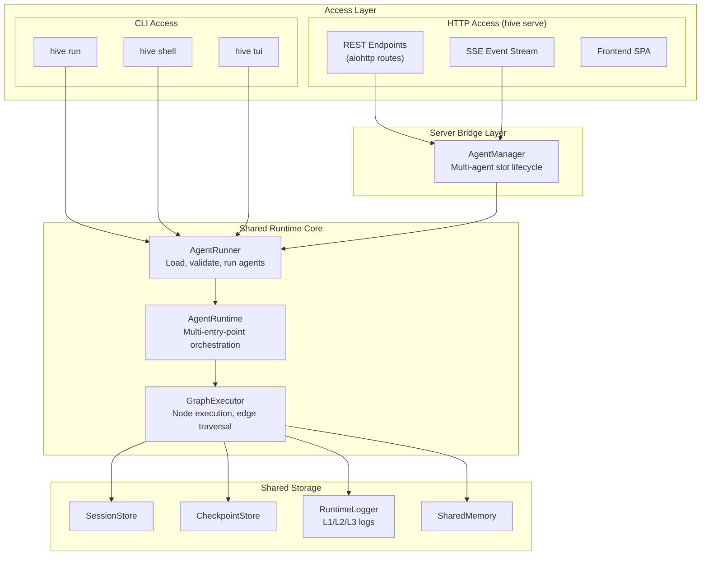
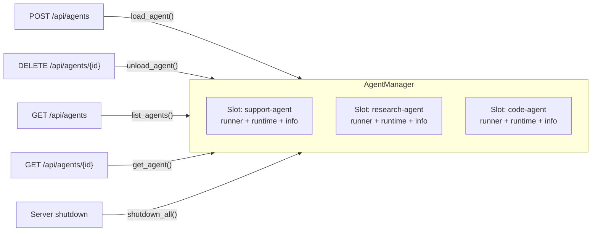

# Server & CLI Architecture: Shared Runtime Primitives

## Executive Summary

The `hive serve` HTTP server and the CLI commands (`hive run`, `hive shell`, `hive tui`) are two access layers built on top of the **same runtime primitives**. There is no separate "server runtime" — the HTTP server is a thin REST/SSE translation layer that delegates every operation to the same `AgentRunner`, `AgentRuntime`, `GraphExecutor`, and storage subsystems that the CLI uses directly.

---

## Architecture Overview



### Key Insight

The only component unique to the HTTP server is `AgentManager` — a thin lifecycle wrapper that holds multiple `AgentSlot` instances concurrently. Each slot contains the **exact same objects** the CLI creates:

```python
@dataclass
class AgentSlot:
    id: str
    agent_path: Path
    runner: AgentRunner      # Same as CLI
    runtime: AgentRuntime    # Same as CLI
    info: AgentInfo          # Same as CLI
    loaded_at: float
```

---

## The Shared Runtime Stack

### Layer 1: AgentRunner

The entry point for loading and running any agent, regardless of access mode.

```python
# CLI usage (hive run)
runner = AgentRunner.load("exports/my-agent", model="claude-sonnet-4-6")
result = await runner.run(input_data={"query": "hello"})

# Server usage (identical call inside AgentManager.load_agent)
runner = AgentRunner.load(agent_path, model=model, interactive=False)
```

**Responsibilities:**
- Load agents from `agent.json` or `agent.py`
- Discover tools from `tools.py` and `mcp_servers.json`
- Validate credentials before execution
- Provide `AgentInfo` and `ValidationResult` inspection

### Layer 2: AgentRuntime

The orchestrator for concurrent, multi-entry-point execution.

```python
# Both CLI (TUI/shell) and server use the same runtime
runtime = runner._agent_runtime
await runtime.start()

# Triggering execution — identical call in both modes
exec_id = await runtime.trigger("default", {"query": "hello"})

# Injecting user input — identical call in both modes
await runtime.inject_input(node_id="chat", content="user message")

# Subscribing to events — CLI uses for TUI, server uses for SSE
sub_id = runtime.subscribe_to_events([EventType.CLIENT_OUTPUT_DELTA], handler)
```

### Layer 3: GraphExecutor

Executes the agent graph node-by-node. Completely unaware of whether it was invoked from CLI or HTTP.

**Responsibilities:**
- Node execution following `GraphSpec` edges
- Edge condition evaluation and routing
- `SharedMemory` management across nodes
- Checkpoint creation for resumability
- HITL pause points at `client_facing` nodes

### Layer 4: Storage

All storage subsystems are shared — sessions, checkpoints, and logs written via CLI are readable via the HTTP server and vice versa.

```
~/.hive/agents/{agent_name}/
├── sessions/                          # SessionStore
│   └── session_YYYYMMDD_HHMMSS_{uuid}/
│       ├── state.json                 # Session state
│       ├── conversations/             # Per-node EventLoop state
│       ├── artifacts/                 # Large outputs
│       └── logs/                      # L1/L2/L3 observability
│           ├── summary.json
│           ├── details.jsonl
│           └── tool_logs.jsonl
├── runtime_logs/                      # RuntimeLogger
└── artifacts/                         # Fallback storage
```

---

## HTTP Endpoint to Runtime Primitive Mapping

Every HTTP endpoint is a direct, thin delegation to a shared runtime method. No execution logic lives in the route handlers.

### Agent Lifecycle

| HTTP Endpoint | Method | Runtime Primitive |
|---|---|---|
| `POST /api/agents` | Load agent | `AgentRunner.load()` → `runtime.start()` |
| `DELETE /api/agents/{id}` | Unload agent | `runner.cleanup_async()` |
| `GET /api/agents/{id}` | Agent info | `runner.info()` → `AgentInfo` |
| `GET /api/agents/{id}/stats` | Statistics | Runtime metrics collection |
| `GET /api/agents/{id}/entry-points` | Entry points | `runtime.get_entry_points()` |
| `GET /api/agents/{id}/graphs` | List graphs | `runtime.list_graphs()` |
| `GET /api/discover` | Discover agents | Filesystem scan (same as `hive list`) |

### Execution Control

| HTTP Endpoint | Method | Runtime Primitive |
|---|---|---|
| `POST /api/agents/{id}/trigger` | Start execution | `runtime.trigger(entry_point_id, input_data)` |
| `POST /api/agents/{id}/chat` | Auto-route | `runtime.inject_input()` or `runtime.trigger()` |
| `POST /api/agents/{id}/inject` | Send user input | `runtime.inject_input(node_id, content)` |
| `POST /api/agents/{id}/resume` | Resume session | `runtime.trigger()` with `session_state` |
| `POST /api/agents/{id}/stop` | Pause execution | Cancels the execution task |
| `POST /api/agents/{id}/replay` | Replay checkpoint | Checkpoint restore → `runtime.trigger()` |
| `GET /api/agents/{id}/goal-progress` | Goal progress | `runtime.get_goal_progress()` |

### Event Streaming

| HTTP Endpoint | Method | Runtime Primitive |
|---|---|---|
| `GET /api/agents/{id}/events` | SSE stream | `runtime.subscribe_to_events()` |

Default event types streamed: `CLIENT_OUTPUT_DELTA`, `CLIENT_INPUT_REQUESTED`, `LLM_TEXT_DELTA`, `TOOL_CALL_STARTED`, `TOOL_CALL_COMPLETED`, `EXECUTION_STARTED`, `EXECUTION_COMPLETED`, `EXECUTION_FAILED`, `EXECUTION_PAUSED`, `NODE_LOOP_STARTED`, `NODE_LOOP_COMPLETED`, `EDGE_TRAVERSED`, `GOAL_PROGRESS`.

### Session Management

| HTTP Endpoint | Method | Runtime Primitive |
|---|---|---|
| `GET /api/agents/{id}/sessions` | List sessions | `SessionStore.list_sessions()` |
| `GET /api/agents/{id}/sessions/{sid}` | Session details | `SessionStore.read_state()` |
| `DELETE /api/agents/{id}/sessions/{sid}` | Delete session | `SessionStore.delete_session()` |
| `GET /api/agents/{id}/sessions/{sid}/checkpoints` | List checkpoints | `CheckpointStore.list_checkpoints()` |
| `POST /api/agents/{id}/sessions/{sid}/checkpoints/{cid}/restore` | Restore checkpoint | Checkpoint load → `runtime.trigger()` |
| `GET /api/agents/{id}/sessions/{sid}/messages` | Chat history | `ConversationStore` reads |

### Graph Inspection

| HTTP Endpoint | Method | Runtime Primitive |
|---|---|---|
| `GET /api/agents/{id}/graphs/{gid}/nodes` | List nodes | `GraphSpec` inspection |
| `GET /api/agents/{id}/graphs/{gid}/nodes/{nid}` | Node details | `GraphSpec` node lookup |
| `GET /api/agents/{id}/graphs/{gid}/nodes/{nid}/criteria` | Success criteria | Node criteria + judge verdicts |

### Logging

| HTTP Endpoint | Method | Runtime Primitive |
|---|---|---|
| `GET /api/agents/{id}/logs` | Agent logs | `RuntimeLogger` queries |
| `GET /api/agents/{id}/graphs/{gid}/nodes/{nid}/logs` | Node logs | `RuntimeLogger` node-scoped queries |

---

## What Differs Between CLI and HTTP

The differences are in the **access pattern**, not the runtime behavior.

| Concern | CLI | HTTP Server |
|---|---|---|
| **Multi-agent** | One runner per process | `AgentManager` holds N slots concurrently |
| **User input** | stdin (shell) / TUI widget | `POST /inject` or `POST /chat` |
| **Event streaming** | `subscribe_to_events()` → TUI update | Same subscription → SSE stream |
| **HITL approval** | `set_approval_callback()` + stdin | `CLIENT_INPUT_REQUESTED` event → `/inject` |
| **Agent lifecycle** | Process start → run → exit | Dynamic load/unload via REST calls |
| **Concurrency** | Sequential (one run at a time) | Async — multiple triggers, multiple agents |
| **Agent discovery** | `hive list` scans dirs | `GET /api/discover` scans dirs (same logic) |
| **Frontend** | Terminal / Textual TUI | React SPA served from `frontend/dist/` |

---

## The AgentManager Bridge

The only component unique to the HTTP server. It manages the lifecycle of multiple loaded agents within a single process.



**Key design choices:**
- **Thread-safe** via `asyncio.Lock` — no race conditions during load/unload
- **Blocking I/O offloaded** — `AgentRunner.load()` runs in `run_in_executor` to avoid blocking the event loop
- **Same pattern as TUI** — the comment in source explicitly notes this: `# Blocking I/O — load in executor (same as tui/app.py:362-368)`

---

## How the `/chat` Endpoint Auto-Routes

The `/chat` endpoint demonstrates the thin-wrapper pattern. It checks runtime state and delegates:

```
POST /api/agents/{id}/chat  { "message": "hello" }
                │
                ▼
    Is any node waiting for input?
        │                   │
       YES                  NO
        │                   │
        ▼                   ▼
  runtime.inject_input()  runtime.trigger()
        │                   │
        ▼                   ▼
  { "status": "injected",  { "status": "started",
    "node_id": "..." }       "execution_id": "..." }
```

This is the same decision a human makes in the shell — if the agent is waiting for input, provide it; otherwise start a new execution.

---

## Concurrent Judge & Queen: Multi-Graph Monitoring Primitives

The Worker Health Judge and Queen triage system introduce **secondary graphs** that run alongside a primary worker graph within the same `AgentRuntime`. They share the runtime's `EventBus` but have fully isolated storage. This section documents the new runtime primitives, EventBus events, data models, and storage layout they introduce.

### Architecture

```
One AgentRuntime (shared EventBus)
|
+-- Worker Graph (primary)          trigger_type: manual
|   Entry point: "start" -> worker node (event_loop, client_facing)
|
+-- Health Judge Graph (secondary)  trigger_type: timer (2 min)
|   Entry point: "health_check" -> judge node (event_loop, autonomous)
|   isolation_level: isolated
|   conversation_mode: continuous
|
+-- Queen Graph (secondary)         trigger_type: event (worker_escalation_ticket)
    Entry point: "ticket_receiver" -> ticket_triage node (event_loop)
    isolation_level: isolated
```

### New EventBus Event Types

Two new events added to `EventType` enum:

#### `WORKER_ESCALATION_TICKET`

Emitted by the health judge's `emit_escalation_ticket` tool when the judge detects a sustained degradation pattern in the worker.

```python
EventBus.emit_worker_escalation_ticket(
    stream_id: str,        # Judge's stream ID (e.g. "worker_health_judge::health_check")
    node_id: str,          # "judge"
    ticket: dict,          # Full EscalationTicket (see data model below)
    execution_id: str | None = None,
)
```

**Event data payload:**

```json
{
  "ticket": {
    "ticket_id": "uuid",
    "created_at": "ISO8601",
    "worker_agent_id": "deep_research_agent",
    "worker_session_id": "session_20260223_130234_a30df858",
    "worker_node_id": "researcher",
    "worker_graph_id": "deep-research-graph",
    "severity": "high",
    "cause": "Node has produced 18 consecutive RETRY verdicts with identical error...",
    "judge_reasoning": "Steps unchanged across last 3 checks. Evidence shows repeated...",
    "suggested_action": "Restart node with modified prompt or escalate to human.",
    "recent_verdicts": ["RETRY", "RETRY", "RETRY", "CONTINUE", "RETRY"],
    "total_steps_checked": 47,
    "steps_since_last_accept": 18,
    "stall_minutes": null,
    "evidence_snippet": "Error: API returned 429 rate limit exceeded..."
  }
}
```

**Subscribers:** Queen's `ticket_receiver` entry point (event-driven). HTTP server should forward via SSE for dashboard UIs.

#### `QUEEN_INTERVENTION_REQUESTED`

Emitted by the queen's `notify_operator` tool after triaging an escalation ticket and deciding the human operator should be involved.

```python
EventBus.emit_queen_intervention_requested(
    stream_id: str,          # Queen's stream ID
    node_id: str,            # "ticket_triage"
    ticket_id: str,          # References the original EscalationTicket
    analysis: str,           # Queen's 2-3 sentence analysis
    severity: str,           # "low" | "medium" | "high" | "critical"
    queen_graph_id: str,     # "hive_coder_queen"
    queen_stream_id: str,    # "hive_coder_queen::ticket_receiver"
    execution_id: str | None = None,
)
```

**Event data payload:**

```json
{
  "ticket_id": "uuid",
  "analysis": "Worker is stuck in a rate-limit retry loop for 6+ minutes. Suggest pausing and retrying with backoff.",
  "severity": "high",
  "queen_graph_id": "hive_coder_queen",
  "queen_stream_id": "hive_coder_queen::ticket_receiver"
}
```

**Subscribers:** TUI (shows non-disruptive overlay). HTTP server should forward via SSE.

### New Data Model: EscalationTicket

```python
# core/framework/runtime/escalation_ticket.py
class EscalationTicket(BaseModel):
    ticket_id: str              # Auto-generated UUID
    created_at: str             # Auto-generated ISO8601

    # Worker identification
    worker_agent_id: str        # Agent name (e.g. "deep_research_agent")
    worker_session_id: str      # Session being monitored
    worker_node_id: str         # Primary graph's entry node
    worker_graph_id: str        # Primary graph ID

    # Problem characterization (LLM-generated by judge)
    severity: Literal["low", "medium", "high", "critical"]
    cause: str                  # What the judge observed
    judge_reasoning: str        # Why the judge decided to escalate
    suggested_action: str       # Recommended intervention

    # Evidence
    recent_verdicts: list[str]  # Last N verdicts (ACCEPT/RETRY/CONTINUE/ESCALATE)
    total_steps_checked: int    # Total log steps seen
    steps_since_last_accept: int
    stall_minutes: float | None # Wall-clock since last step (None if active)
    evidence_snippet: str       # Truncated recent LLM output
```

### Modified AgentRuntime APIs

The following existing methods gained a `graph_id` parameter to support multi-graph routing. When `graph_id=None` (default), the method targets the **active graph** (`active_graph_id`), falling back to the primary graph. Existing callers that pass no `graph_id` are unaffected.

| Method | New parameter | Notes |
|---|---|---|
| `trigger()` | `graph_id: str \| None = None` | Routes to the named graph's stream |
| `get_entry_points()` | `graph_id: str \| None = None` | Returns entry points for the specified graph |
| `get_stream()` | `graph_id: str \| None = None` | Resolves stream via active graph first |
| `get_execution_result()` | `graph_id: str \| None = None` | Looks up result in the graph's stream |
| `cancel_execution()` | `graph_id: str \| None = None` | Cancels execution in the graph's stream |

### New AgentRuntime APIs

| Method | Signature | Description |
|---|---|---|
| `get_active_graph()` | `-> GraphSpec` | Returns the `GraphSpec` for the currently active graph (used by TUI/chat routing) |
| `active_graph_id` (property) | `str` (get/set) | The graph that receives user input. Set by TUI when switching between worker and queen views |

### Proposed HTTP Endpoints

These endpoints are not yet implemented. They expose the new multi-graph and monitoring primitives to the HTTP access layer, following the same thin-delegation pattern as existing endpoints.

#### Multi-Graph Control

| HTTP Endpoint | Method | Runtime Primitive |
|---|---|---|
| `POST /api/agents/{id}/graphs` | Load secondary graph | `runtime.add_graph(graph_id, graph, goal, entry_points)` |
| `DELETE /api/agents/{id}/graphs/{gid}` | Unload secondary graph | `runtime.remove_graph(graph_id)` (not yet implemented) |
| `GET /api/agents/{id}/graphs/{gid}/sessions` | List graph sessions | Graph-specific `SessionStore.list_sessions()` |
| `GET /api/agents/{id}/graphs/{gid}/sessions/{sid}` | Graph session details | Graph-specific `SessionStore.read_state()` |
| `PUT /api/agents/{id}/active-graph` | Switch active graph | `runtime.active_graph_id = graph_id` |
| `GET /api/agents/{id}/active-graph` | Get active graph | `runtime.active_graph_id` |

#### Worker Health Monitoring

| HTTP Endpoint | Method | Runtime Primitive |
|---|---|---|
| `GET /api/agents/{id}/health` | Health summary | Calls `get_worker_health_summary()` tool (reads worker session logs) |
| `GET /api/agents/{id}/escalations` | List escalation tickets | Query `WORKER_ESCALATION_TICKET` events from EventBus history |
| `GET /api/agents/{id}/escalations/{tid}` | Ticket details | Lookup specific ticket by `ticket_id` |

#### Event Streaming Additions

The SSE stream (`GET /api/agents/{id}/events`) should include the two new event types in its default set:

```
Default event types: ..., WORKER_ESCALATION_TICKET, QUEEN_INTERVENTION_REQUESTED
```

Clients can subscribe selectively:

```
GET /api/agents/{id}/events?types=worker_escalation_ticket,queen_intervention_requested
```

### Isolated Session Lifecycle for Secondary Graphs

Isolated entry points (`isolation_level="isolated"`) use **persistent sessions** — a single session is created on first trigger and reused for all subsequent triggers of the same entry point. This is critical for:

- **Timer-driven** entry points (health judge): one session across all timer ticks, so `conversation_mode="continuous"` works and the judge accumulates observations in its conversation history.
- **Event-driven** entry points (queen ticket receiver): one session across all received events, so the queen can reference prior triage decisions.

The session reuse is managed by the timer/event handler closures in `AgentRuntime`, which remember the first `execution_id` returned by `stream.execute()` and pass it as `resume_session_id` on all subsequent fires. The `GraphExecutor` detects the existing conversation store, resets the cursor (clearing stale outputs), and appends a transition marker so the LLM knows a new trigger arrived while the conversation thread carries forward.

### Secondary Graph Storage Layout

Secondary graphs have fully isolated storage under `graphs/{graph_id}/` to prevent any interference with the primary worker's sessions, logs, and conversations.

```
~/.hive/agents/{agent_name}/
+-- sessions/                                    # Primary graph only
|   +-- session_YYYYMMDD_HHMMSS_{uuid}/
|       +-- state.json
|       +-- conversations/
|       +-- logs/
+-- graphs/
|   +-- worker_health_judge/                     # Health judge (secondary)
|   |   +-- sessions/
|   |   |   +-- session_YYYYMMDD_HHMMSS_{uuid}/  # ONE persistent session
|   |   |       +-- state.json
|   |   |       +-- conversations/judge/         # Continuous conversation
|   |   |       +-- logs/
|   |   |           +-- tool_logs.jsonl
|   |   |           +-- details.jsonl
|   |   +-- runtime_logs/
|   +-- hive_coder_queen/                        # Queen triage (secondary)
|       +-- sessions/
|       |   +-- session_YYYYMMDD_HHMMSS_{uuid}/  # ONE persistent session
|       |       +-- state.json
|       |       +-- conversations/ticket_triage/
|       |       +-- logs/
|       +-- runtime_logs/
+-- runtime_logs/                                # Primary graph runtime logs
```

Each secondary graph gets its own `SessionStore` and `RuntimeLogStore` scoped to `graphs/{graph_id}/`. This is set up in `AgentRuntime.add_graph()`:

```python
graph_base = self._session_store.base_path / subpath  # e.g. .../graphs/worker_health_judge
graph_session_store = SessionStore(graph_base)
graph_log_store = RuntimeLogStore(graph_base / "runtime_logs")
```

### Worker Monitoring Tools

Three tools registered via `register_worker_monitoring_tools(registry, event_bus, storage_path)`. These are bound to the worker's EventBus and storage path at registration time.

| Tool | Used by | Description |
|---|---|---|
| `get_worker_health_summary(session_id?, last_n_steps?)` | Health Judge | Reads worker's `sessions/{id}/logs/tool_logs.jsonl`. Auto-discovers active session if `session_id` omitted. Returns JSON with `worker_agent_id`, `worker_graph_id`, `session_id`, `total_steps`, `recent_verdicts`, `steps_since_last_accept`, `stall_minutes`, `evidence_snippet`. |
| `emit_escalation_ticket(ticket_json)` | Health Judge | Validates JSON against `EscalationTicket` schema (Pydantic rejects partial tickets), then calls `EventBus.emit_worker_escalation_ticket()`. |
| `notify_operator(ticket_id, analysis, urgency)` | Queen | Calls `EventBus.emit_queen_intervention_requested()` so the TUI/frontend surfaces a notification. |

### New File Reference

| Component | Path |
|---|---|
| EscalationTicket model | `core/framework/runtime/escalation_ticket.py` |
| Worker Health Judge graph | `core/framework/monitoring/worker_health_judge.py` |
| Worker monitoring tools | `core/framework/tools/worker_monitoring_tools.py` |
| Monitoring package init | `core/framework/monitoring/__init__.py` |

---

## File Reference

| Component | Path |
|---|---|
| CLI entry point | `core/framework/runner/cli.py` |
| HTTP app factory | `core/framework/server/app.py` |
| Agent manager | `core/framework/server/agent_manager.py` |
| Agent routes | `core/framework/server/routes_agents.py` |
| Execution routes | `core/framework/server/routes_execution.py` |
| Event routes | `core/framework/server/routes_events.py` |
| Session routes | `core/framework/server/routes_sessions.py` |
| Graph routes | `core/framework/server/routes_graphs.py` |
| Log routes | `core/framework/server/routes_logs.py` |
| SSE helper | `core/framework/server/sse.py` |
| AgentRunner | `core/framework/runner/runner.py` |
| AgentRuntime | `core/framework/runtime/agent_runtime.py` |
| GraphExecutor | `core/framework/graph/executor.py` |
| SessionStore | `core/framework/storage/session_store.py` |
| CheckpointStore | `core/framework/storage/checkpoint_store.py` |
| Runtime logger | `core/framework/runtime/core.py` |
